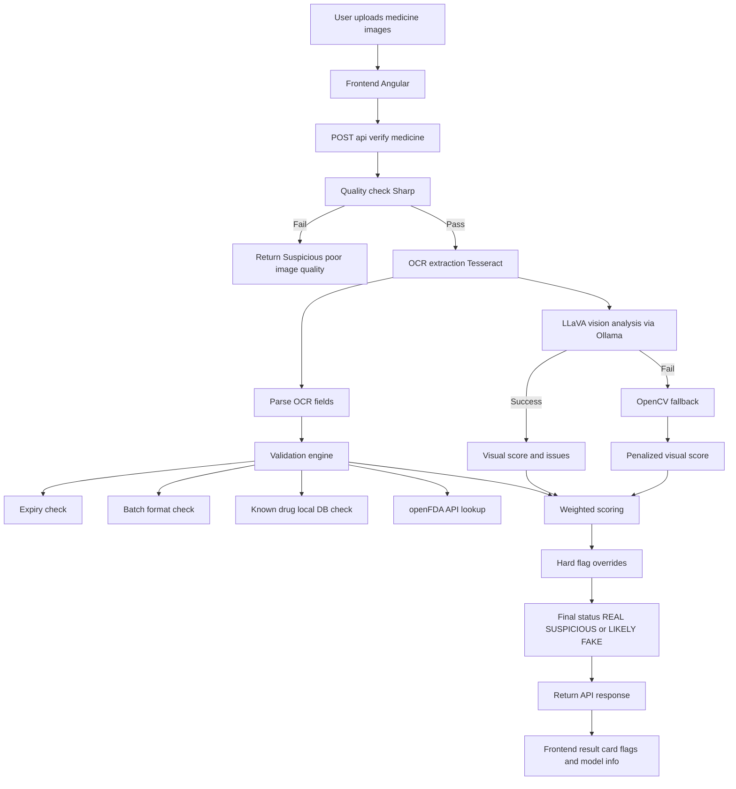

# 🚀 Medi-Verify AI - Intelligent Medicine Authenticity Verification

Medi-Verify is a state-of-the-art web application designed to combat the issue of counterfeit medicines. Built with Angular on the frontend and Node.js/Express.js on the backend, it uses:
- **LLaVA (via Ollama)** for visual forensics (hologram/logo/tampering/print quality)
- **Sharp** for deterministic local image-quality and print metrics (no extra API calls)
- **TrOCR (HF)** for text extraction, with a **local Tesseract OCR fallback** when Hugging Face isn’t available

## 🌟 Key Features

- **AI-Powered Medicine Verification**: Upload an image of a medicine package or bill, and our AI analyzes the packaging details, serial numbers, and text to determine authenticity.
- **Explainable AI Insights**: The application provides an *"AI Explanation Panel"* breaking down exactly why a medicine was flagged as authentic or counterfeit, including text recognized, visual features matched, and confidence levels.
- **Premium Glassmorphism UI**: A sleek, modern user interface built using vanilla CSS with complex glassmorphism effects, immersive background animations, and highly responsive components.
- **Real-Time Analysis**: Integrates a seamless backend processing pipeline using Ollama + LLaVA (and optional HF TrOCR) for low-latency predictions.

## 🛠️ Technology Stack

- **Frontend**: Angular 17+ (TypeScript, RxJS)
- **Styling**: Vanilla CSS (CSS Variables, Flexbox/Grid, Animations)
- **Backend API**: Node.js & Express.js
- **Artificial Intelligence / Vision**:
   - LLaVA (local via Ollama)
  - TrOCR / OCR (Hugging Face) with local Tesseract fallback
  - Deterministic image-quality metrics using Sharp

## 🚀 Getting Started

Follow these instructions to run the application locally.

### Prerequisites
- Node.js (v18+)
- Angular CLI
- Ollama installed locally (for LLaVA vision analysis)
- Hugging Face token (optional but recommended for OCR accuracy)

### 1. Backend Setup

1. Navigate to the `server` directory:
   ```bash
   cd server
   ```
2. Install dependencies:
   ```bash
   npm install
   ```
3. Create a `.env` file in the `server` directory and add your API credentials:
   ```env
   PORT=5000
   # Optional: set only if Ollama is running on a non-default host/port
   # OLLAMA_HOST=http://127.0.0.1:11434

   # Optional: used for OCR (TrOCR) with Hugging Face.
   # If missing or invalid, the backend falls back to local Tesseract OCR.
   HF_TOKEN=your_hugging_face_token_here
   ```
4. Ensure Ollama is running and the LLaVA model is available:
   ```bash
   ollama serve
   ollama pull llava
   ```
5. Start the backend server:
   ```bash
   npm run dev
   ```
   *The backend will be running at `http://localhost:5000`.*

### 2. Frontend Setup

1. Open a new terminal and stay in the root project directory (`medi-verify`).
2. Install frontend dependencies:
   ```bash
   npm install
   ```
3. Start the Angular application:
   ```bash
   ng serve
   ```
4. Open your browser and navigate to `http://localhost:4200`.

### 3. Quick Run Flow (Recommended)

1. Start backend first (`server` folder):
   ```bash
   cd server
   npm run dev
   ```
2. In a second terminal, start frontend (project root):
   ```bash
   ng serve
   ```
3. Upload a medicine image in the UI and view the score + red flags.

## 🛟 Troubleshooting

### Visual checks unavailable (LLaVA / Ollama failure)

If Ollama/LLaVA cannot be reached, the backend will degrade gracefully:
- OCR + deterministic checks still run
- the UI shows user-friendly red flags (instead of raw model failures)

Checklist:
- Ensure Ollama is running (`ollama serve`)
- Ensure `llava` model exists (`ollama pull llava`)
- Restart the backend after editing `.env`

### OCR fallback active (HF_TOKEN missing)

If `HF_TOKEN` is missing/invalid, the backend will fall back to local **Tesseract OCR** (with Sharp preprocessing).

Checklist:
- Ensure the variable name is exactly `HF_TOKEN`
- Restart the backend after editing `.env`

Minimal `server/.env` example:

```env
PORT=5000
# OLLAMA_HOST=http://127.0.0.1:11434
HF_TOKEN=hf_your_real_token_here
```

## 🧠 How the AI Works

Step-by-step pipeline:
1. The user uploads an image in the UI (base64 payload sent to the backend).
2. **Quality gate (Sharp)** runs locally to reject very small/dark/blurry images early.
3. **OCR (Step 1)**:
   - If `HF_TOKEN` is available: run TrOCR via Hugging Face.
   - Otherwise: run local **Tesseract OCR** with Sharp preprocessing.
   Then parse OCR fields and run deterministic OCR validations.
4. **Visual forensics (Step 2)**: LLaVA (via Ollama) analyzes holograms/logo/print/tampering with a vision-only prompt.
5. **Deterministic classification (Step 3)**: Sharp print metrics are incorporated into the final trust score.
6. The backend computes final `authenticity_score` + `summary` using a weighted fusion of:
   - LLaVA visual evidence
   - OCR validation issues
   - Deterministic image-quality metrics

## 🔁 System Flowchart (Mermaid)

Use this parser-safe Mermaid flowchart in Markdown viewers that support Mermaid:



## 🤝 Contributing
Contributions are always welcome. Please make sure to follow the established code style and commit message conventions.

## 📄 License
This project is open-sourced under the [MIT License](LICENSE.md).
